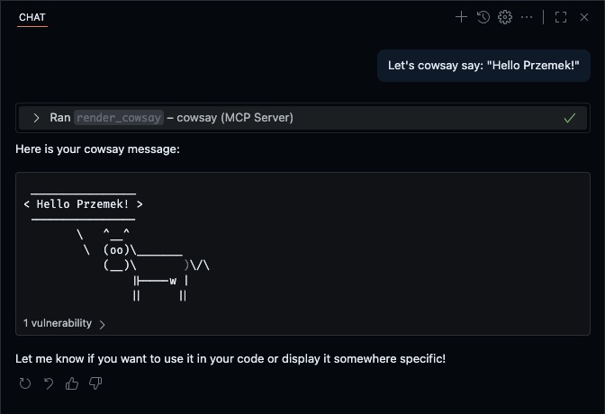

# mcp-server-cowsay

A simple [MCP (Model Context Protocol)](https://modelcontextprotocol.io) server to render a cow saying whatever you want.

For educational purposes ;)

## How to use in GitHub Copilot

Put the following code snippet into `mcp.json` file and run a server.

```jsonc
// mcp.json
{ 
  "servers": {
    // ...
    "cowsay": {
      "command": "node",
      "args": ["PATH_TO_DIRECTORY/mcp-server-cowsay/index.js"]
    }
  }
}

```

Voilà ;)


